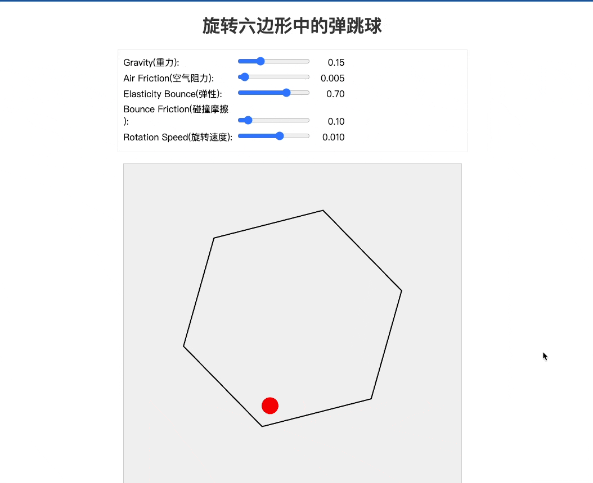

# 旋转六边形中的弹跳球


这是一个基于 p5.js 的物理模拟项目，展示了一个在旋转六边形容器中运动的弹跳球。该项目模拟了重力、空气阻力、弹性碰撞等物理现象。

## 如何复现
### https://aistudio.google.com
(需魔法)选择Gemini 2.5 pro 0325模型
### prompt
```
write a p5.js program that shows a ball bouncing inside a spinning hexagon. The ball should be affected by gravity and friction, and it must bounce off the rotating walls realistically, add sliders to adjust parameters.
```
## 功能特点

- 实时物理模拟
  - 重力效应
  - 空气阻力
  - 弹性碰撞
  - 碰撞摩擦
  - 旋转动力学

- 交互控制
  - 可调节重力大小
  - 可调节空气阻力
  - 可调节弹性系数
  - 可调节碰撞摩擦
  - 可控制六边形旋转速度

## 技术栈

- HTML5
- JavaScript
- p5.js 图形库

## 如何运行

1. 克隆项目到本地
2. 使用现代浏览器打开 index.html 文件
3. 通过滑块控制各种物理参数
4. 观察球体在旋转六边形中的运动

## 控制参数说明

- 重力 (Gravity): 控制向下的重力加速度 (0-0.5)
- 空气阻力 (Air Friction): 控制空气阻力大小 (0-0.1)
- 弹性 (Elasticity): 控制碰撞弹性系数 (0-1)
- 碰撞摩擦 (Bounce Friction): 控制碰撞时的摩擦力 (0-1)
- 旋转速度 (Rotation Speed): 控制六边形的旋转速度 (-0.05-0.05)

## 物理模型

项目实现了以下物理模型：
- 基础运动学：位置、速度、加速度的实时更新
- 碰撞检测：精确的线段碰撞检测
- 碰撞响应：考虑弹性和摩擦的碰撞处理
- 旋转动力学：旋转物体与运动物体的相互作用

## 项目结构

- `index.html`: 页面结构和样式
- `sketch.js`: 主要的物理模拟和绘图逻辑

## 使用许可

MIT License